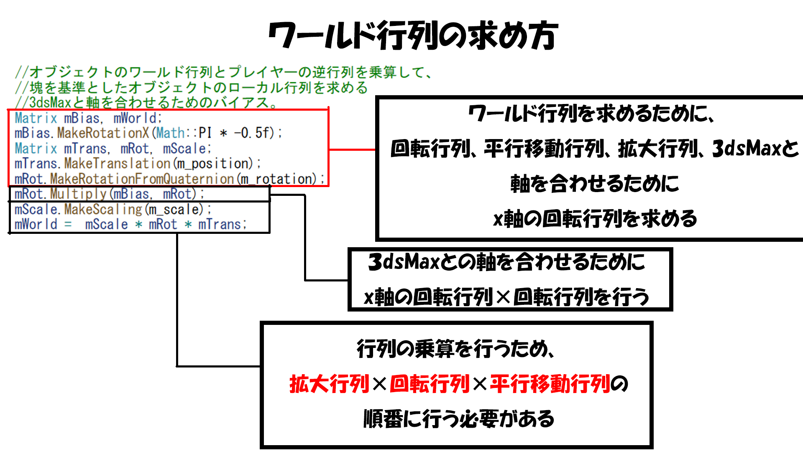

# **塊魂**

 

# **目次**
- [**塊魂**](#塊魂)
- [**目次**](#目次)
- [**自己紹介**](#自己紹介)
- [**ゲーム概要**](#ゲーム概要)
- [**操作方法**](#操作方法)
- [**制作理由**](#制作理由)
- [**ゲームのこだわり**](#ゲームのこだわり)
  - [**1.タイトル画面**](#1タイトル画面)
  - [**2.ゲーム中カメラの動き**](#2ゲーム中カメラの動き)
  - [**3.ゲーム内の操作**](#3ゲーム内の操作)
  - [**4.巻き込めないオブジェクト**](#4巻き込めないオブジェクト)
- [**ゲーム関係の技術紹介**](#ゲーム関係の技術紹介)
  - [**1.巻き込み処理**](#1巻き込み処理)
    - [**作成動機**](#作成動機)
    - [**実装方法**](#実装方法)
    - [**a.オブジェクトと塊のワールド行列を求めて、塊のワールド行列の逆行列を求める。**](#aオブジェクトと塊のワールド行列を求めて塊のワールド行列の逆行列を求める)
    - [**b.塊を基準としたオブジェクトのローカル座標を求める**](#b塊を基準としたオブジェクトのローカル座標を求める)
    - [**c.最終的なオブジェクトのワールド行列を求める**](#c最終的なオブジェクトのワールド行列を求める)
    - [**まとめ**](#まとめ)
  - [**2.オブジェトデータの管理とオブジェクトの生成**](#2オブジェトデータの管理とオブジェクトの生成)
    - [**作成動機**](#作成動機-1)
    - [**実装方法**](#実装方法-1)
    - [**a.エクセルの作成**](#aエクセルの作成)
    - [**b.レベルデータの作成**](#bレベルデータの作成)
    - [**c.モデルの検索**](#cモデルの検索)
    - [**d.モデルの移動**](#dモデルの移動)
    - [**まとめ**](#まとめ-1)
  - [**3.インスタンシング描画**](#3インスタンシング描画)
    - [**インスタンシング描画について**](#インスタンシング描画について)
    - [**作成動機**](#作成動機-2)
    - [**まとめ**](#まとめ-2)
  - [**4.ビューポートの作成**](#4ビューポートの作成)
  - [**5.輪郭線の描画**](#5輪郭線の描画)
  - [**6.トゥーンシェーダー**](#6トゥーンシェーダー)
- [**グラフィック関係**](#グラフィック関係)
- [**まとめ**](#まとめ-3)
- [**参考資料**](#参考資料)

# **自己紹介**
**所属：河原電子ビジネス専門学校ゲームクリエイター科**
 

**名前：伊藤　大起**
 

**趣味：弓道(3年)、料理**
 

# **ゲーム概要**
**1.制作期間**
 
&emsp;**2023年～**
 

**2.制作人数**
 
&emsp;**1人**
 

**3.ジャンル**
 
&emsp;**アクション**
 

**4.プレイ人数**
 
&emsp;**1人**
 

**5.対応ハード**
<cr>
&emsp;**windows11**
 

**6.制作環境**
 
&emsp;**a.エンジン**
 
&emsp;&emsp;**学校内製エンジン(DX12)**
 

&emsp;**b.使用ツール**
 
&emsp;&emsp;**Visual Studio 2022**
 
&emsp;&emsp;**Visual Studio Code**
 
&emsp;&emsp;**3ds Max 2023**
 
&emsp;&emsp;**Adobe Photoshop 2022**
 
&emsp;&emsp;**Excel**
 
&emsp;&emsp;**RenderDoc**
 
&emsp;&emsp;**fork**
 
&emsp;&emsp;**Github**
 
&emsp;&emsp;**Notion**
 

&emsp;**c.使用言語**
 
&emsp;&emsp;**C++**
 
&emsp;&emsp;**HLSL**
 

# **操作方法**

 

# **制作理由**
&emsp;**自分がこのゲームを作ろうと思ったのがきっかけとして、今まで自分がプレイしてきたゲームは敵を武器を使って倒すというゲームが多く、物を巻き込み塊を大きくしていくという、独自の世界観にひかれていきました。**
 

&emsp;**最初のうちは巻き込まないものがあり、それにはじき返されたり、追いかけまわされるなど最初のうちは爽快感はありませんでしたが、物を巻き込み塊が大きくなり今まで追いかけられていた物を巻き込めるようになると、敵を武器を使って倒した時のような爽快感があり、その爽快感が後半は何度も押し寄せるので自分はこのゲームにとても関心を持ちました。**
 

&emsp;**ゲーム制作の勉強をしていく内にこのゲームは様々な技術をしようしていることを知り、このゲームを再現することで、今まで挑戦してこなかった技術に触れあうことが可能なので、自身のスキルアップにつながると思いこのゲームを製作しようと思いました。**
 

# **ゲームのこだわり**
## **1.タイトル画面**
**・AボタンでスタートではなくSTARTを巻き込むことで始めることが出来る。**

 

## **2.ゲーム中カメラの動き**
**・塊が大きくなるにつれて画面に入らなくなるので、一定の大きさの時に後退している**

**・カメラを後退させるときに滑らかに動かすことで、違和感が無い様にしている**

## **3.ゲーム内の操作**

**・操作性をよくするため急周りの際に、速度がある場合、カメラの動きに合わせた動きしている。**

## **4.巻き込めないオブジェクト**

**・巻き込めないオブジェクトにぶつかった時に反射している**

# **ゲーム関係の技術紹介**

## **1.巻き込み処理**

### **作成動機**
**・塊魂を再現する際に最も興味を持った処理だから。**
 
**・行列に対する勉強の良い機会だと思った。**

### **実装方法**
### **a.オブジェクトと塊のワールド行列を求めて、塊のワールド行列の逆行列を求める。**

**ワールド行列を求める方法**

### **b.塊を基準としたオブジェクトのローカル座標を求める**
**逆行列を乗算することでワールド行列からローカル行列への変換を行える。**

### **c.最終的なオブジェクトのワールド行列を求める**

### **まとめ**
**・逆行列やローカル行列の勉強になった。**
 
**・今後のゲーム制作を行う際に行列を生かした難しい処理を実装していきたい。**
 

## **2.オブジェトデータの管理とオブジェクトの生成**

### **作成動機**
**・エクセルを使用したデータ管理に挑戦するため。**
 
**・文字列を使用してモデルの動きや速度を決めるため。**

### **実装方法**
### **a.エクセルの作成**

**・保存形式を気を付ける必要がある。**

**・モデルデータの構造体に渡す。**

### **b.レベルデータの作成**

**・レベルデータの名前で移動速度と移動方法を決めている。**
**・これにより細かい数値を決めやすくなる。**
### **c.モデルの検索**

### **d.モデルの移動**
**・モデルの移動はレベルデータを元に生成する。**

**・モデルの生成はインスタンシング描画にも関係している。**
### **まとめ**
**・エクセルデータを保存した時に日本語が文字化けするなど問題が発生していた。**
 
**・文字コードを勉強する過程で、変数変換の勉強になった。**
 
**・今後もエクセルなどを使用したデータ管理を有効活用して行きたい。**
 

## **3.インスタンシング描画**
### **インスタンシング描画について**
&emsp;**通常のドローコールと違い一つ一つモデルを描画するのではなく、「同じモデルを大量に描画する際のドローコールを一度だけにできる」というテクニックです。**
### **作成動機**
**・通常のドローコールではfpsが10以下しか出なかったので、その問題を解決するため。**

 

### **まとめ**
**・ゲームをプレイする際に問題ない速度で動くようになった**
**・今後同じのモデルを複数生成する際にfpsが落ちないように実装していきたい。**

## **4.ビューポートの作成**

## **5.輪郭線の描画**

## **6.トゥーンシェーダー**

 

# **グラフィック関係**

 

# **まとめ**

 

# **参考資料**
